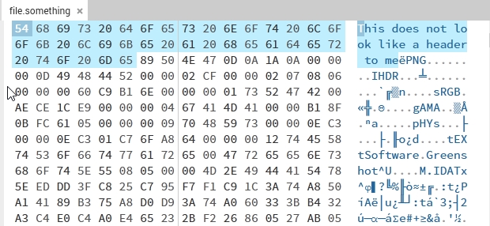
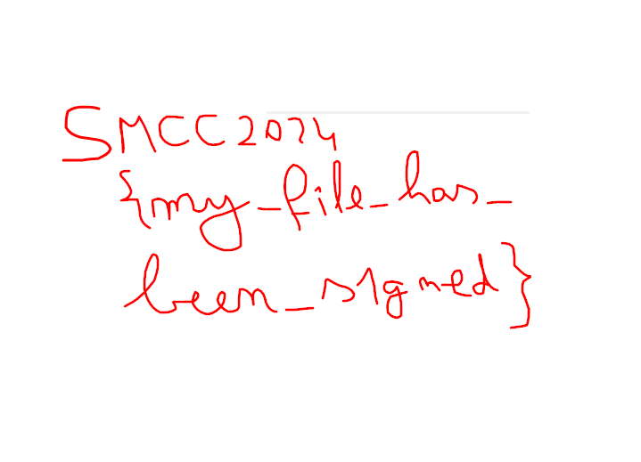

# Magical Bytes 1
Author: [Marin Radu](https://github.com/ChronosPK)

<br>

## Description
```
Identified and removed non-standard bytes preceding the PNG file signature.
```

<br>

## Requirements
- Understanding of file headers
- Basic file carving

<br>

## Solve
Inspect and modify the file's header bytes. 
The beginning of the file contains a message that disrupts the file signature. 
Remove these bytes to restore the header:

1. Analyze the file with a hex editor like [hexedit](https://hexed.it/).
2. Carve out the incorrect bytes preceding the PNG header. For this file, remove the first 38 bytes.
3. Save the corrected file and open it to view the message.



Opening the corrected file will display the flag:



Alternative: use the carving tool `dd`.

<br>

> Flag: `CSCTF{my_file_has_been_s1gned}`
