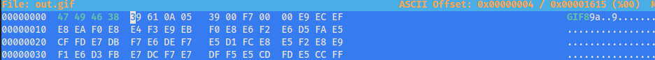

# Magical Bytes 2
Author: [Marin Radu](https://github.com/ChronosPK)

<br>

## Description
```
Extract and correct the file's magic bytes to reveal the hidden message.
```

<br>

## Requirements
- File headers

<br>

## Solve
Analyze and adjust the GIF file header. 
Remove the 13 bytes before the header and invert them back to their original order.

1. Remove the first 13 bytes that precede the header using `dd`:

```bash
dd if=regular-file.something of=out.gif bs=1 skip=13
```

2. Open out.gif with a hex editor and fix the magic bytes:
```bash
hexeditor out.gif # replace 74 94 64 83 with 47 49 46 38
```



Viewing the corrected GIF will display the flag:


<br>

> Flag: `CSCTF{w3ll_d0ne_inve3rt3d_bytes}`