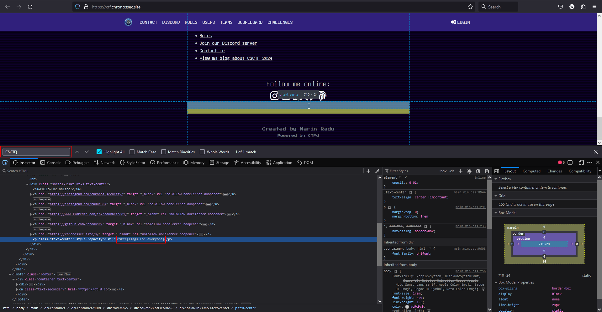
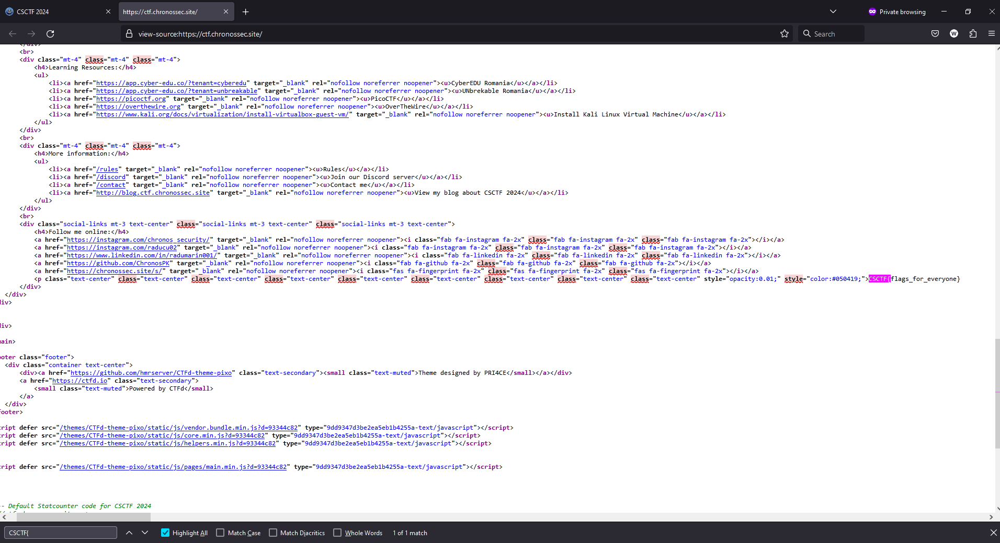

# Index
Author: [Marin Radu](https://github.com/ChronosPK)

<br>

## Description
```
Inspect the website's source code to find the hidden flag.
```

<br>

## Requirements
- Inspecting web page source code

<br>

## Solve
Visit the CTF index page and view the source code (`CTRL+U` on most browsers). 
Search for the flag pattern within the source:





<br>

> Flag: `CSCTF{flags_for_everyone}`