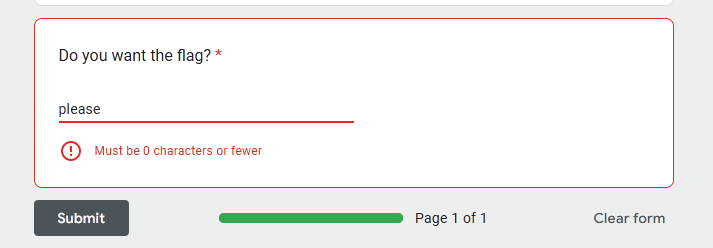
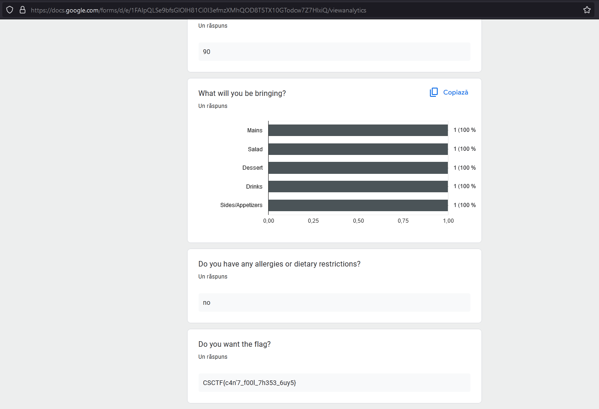

# Participate
Author: [Marin Radu](https://github.com/ChronosPK)

<br>

## Description
```
Analyze the analytics page of a Google Form to find the flag.
```

<br>

## Requirements
- Google Form analytics

<br>

## Solve
Access the analytics of the Google Form. 
The last question has a logic error that doesn't allow you to submit the form.
The flag is posted in the analytics section for the form creator to view:






<br>

> Flag: `CSCTF{c4n'7_f00l_7h353_6uy5}`