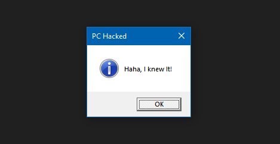

# Prank
Author: [Marin Radu](https://github.com/ChronosPK)

<br>

## Description
```
Examine the contents of a VBS script to find the flag.
```

<br>

## Requirements
- Basic understanding of script files

<br>

## Solve
Open the VBS file in a text editor and look for the flag encoded in base64:

The code's logic doesn't allow you to click on any button until you press "yes" ^0^




<br>

> Flag: `CSCTF{y0u_Ar3_n07_4n_1d10t}`
