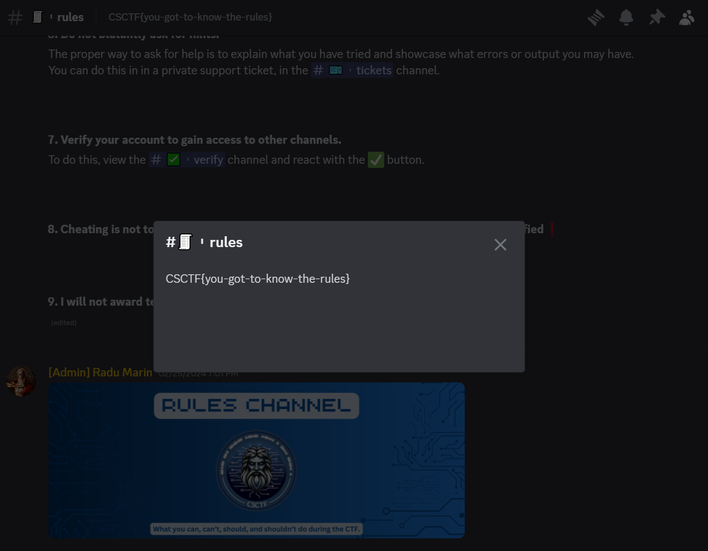

# Rules
Author: [Marin Radu](https://github.com/ChronosPK)

<br>

## Description
```
Discover the flag within the Discord server's channel description.
```

<br>

## Requirements
- Access to the Discord server

<br>

## Solve
Navigate to the "Info" channel on the Discord server. 
The flag is subtly placed in the channel description:



<br>

> Flag: `CSCTF{you-got-to-know-the-rules}`
