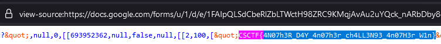

# Simple quiz
Author: [Marin Radu](https://www.linkedin.com/in/radumarin001/)

<br>

## Description
```
Analyze a Google Form to locate a hidden flag.
```

<br>

## Requirements
- Google Forms

<br>

## Solve
Inspect the Google Form and look for hidden elements or references to the flag.
The flag hides in the page source:



<br>

> Flag: `CSCTF{4N07h3R_D4Y_4n07h3r_ch4LL3N93_4n07H3r_W1n}`
