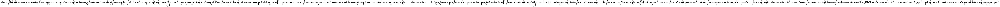
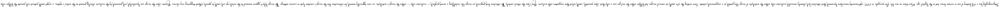

Start by generating a text that will be written on an image.

```
Steganography has a r1ch history of use in various forms, but in the digital age, 1t has taken on new life. For example, in 2017, cyb3rsecurity researchers discovered that attackers had cleverly concealed malicious code within the metadata of image files posted on a compromised website. Users visiting the si7e would see normal images, but hidden within the im2ges was a code that, when executed, would infect their computers with malware. Here's how the attack worked: The attackers first prepared an image file, embedding a secret payload—malicious code—within the image's metadata, an area typically reserved for information like the image's creation date or camera settings. The image didn't appear unusual to the naked eye and could be opened without triggering any alarms. However, when the image was downloaded and processed by the malware already present on the victim's system, a script would extract and execute the hidden code.
```

I replaced some of the letters with numbers: `r1ch`, `1t`, `cyb3rsecurity`, `si7e`, `im2ges`.

The letters introduced are, in order, the following: `11372`.

I can't just keep the image as it is, so I used [this](https://www.dcode.fr/mirror-writing) tool to flip the image vertically.



<br>

I also flipped the resulting image horizontally. 
I used these to hide the next images using `steghide`.
Since `steghide` doesn't support `PNG` files, I converted it into a JPG as well.




<br>

The second image was created using [this](https://www.dcode.fr/friderici-windows-cipher) tool that encodes the challenge's flag.


<br>

Now, I used `steghide` to embed the encoded flag image into the mirrored and flipped image.
```bash
steghide embed -cf mirrored_image_2.jpg -ef encoded_flag.png -sf image.png -p "11372"
```

And send it to the `files` directory for upload.
```bash
cp image.png ../files
```