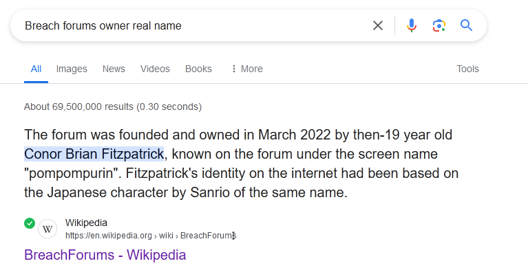

# Breached
Author: [Marin Radu](https://github.com/ChronosPK)

<br>

## Description
```
Search the web to find the real name and age of the Breach Forums' former owner.
```

<br>

## Requirements
- Web browsing
- OSINT techniques

<br>

## Solve
Use a search engine to look up "Breach forums former owner." 
Various sources, including Wikipedia, provide the needed information. 
Ensure the details pertain to the time around the site's seizure by the FBI.

Search a browser for `Breach forums real name and age` and you will find enough resources. <br>
One example is the [Wikipedia page](https://en.wikipedia.org/wiki/BreachForums)



<br>

> Flag: `CSCTF{Conor_Brian_Fitzpatrick_19}`
