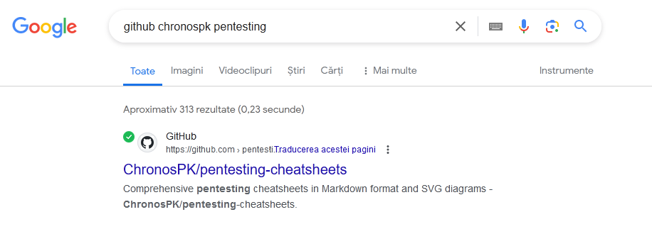

# ChronosPK
Author: [Marin Radu](https://github.com/ChronosPK)

<br>

## Description
```
Find a flag in one of the pentesting repositories owned by ChronosPK on GitHub
```

<br>

## Requirements
- GitHub
- Commit history analysis

<br>

## Solve
You can find my GitHub account on the index and `/contact` pages, or just by searching it in any browser.

Go to my [GitHub account](https://github.com/ChronosPK), then look through the `Pentesting repositories` as the challenge description says. <br>




<br>

Click the **`History`** button to view past commits. <br>


<br>

The last one at the time of the CTF hides the flag:

 

<br>

The flag can be seen [here](https://github.com/ChronosPK/pentesting-cheatsheets/commit/ad537c24f15a489e74958d112d21eefb7ce54f66)

<br>

> Flag: `CSCTF{d0n’t_hid3_your_5ecr375_1n_GIThub}`
