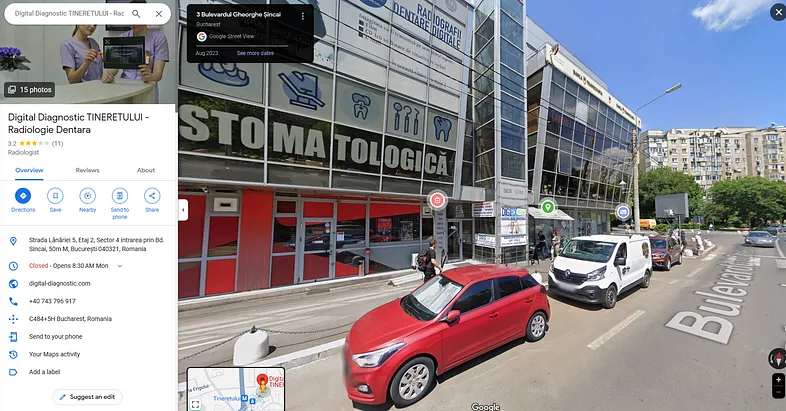
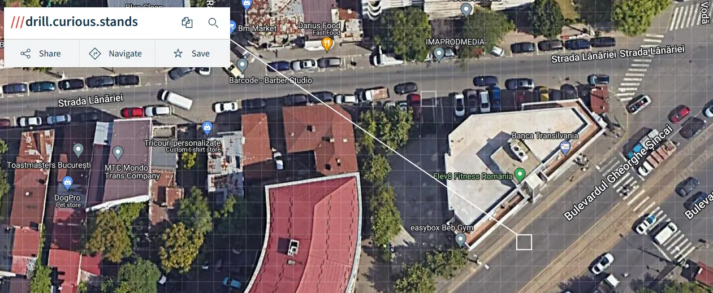

# Cyber Golan
Author: [Marin Radu](https://github.com/ChronosPK)

<br>

## Description
```
Find the car's location from the given image.
```

<br>

## Requirements
- Image analysis
- Location services

<br>

## Solve
Analyzing the image, we see Romanian text and a Romanian car: `Logan`, therefore we are in Romania. 
The car specified has "IF" numbers, so it might be from Bucharest, the capital.

The best thing you can search for is the dental radiology center. 
But, if you try to search it `on google maps`, you will find 4 centers, none of which is the one we are looking for.

[Google Maps search](https://www.google.com/maps/search/digirx+bucuresti/@44.453391,26.0503717,12z?entry=ttu)

Then, you should go to the center's website and look through the locations available (13).

The desired one is [here](https://digirx.ro/centru-bucuresti-tineretului/)



Now, there is a [website](https://en.wikipedia.org/wiki/What3words) that gives you 3 words for each 3-by-3-metre square.



<br>

> Flag: `CSCTF{drill.curious.stands}`