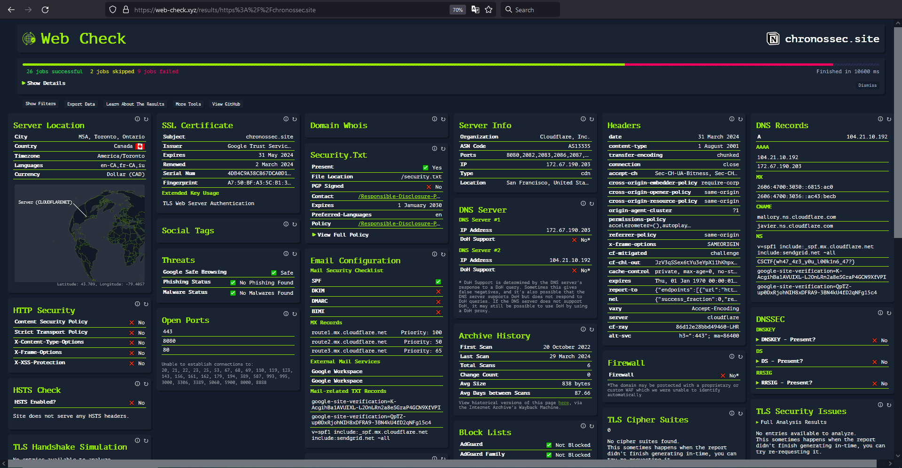

# WHOis #3
Author: [Marin Radu](https://github.com/ChronosPK)

<br>

## Description
```
Use online resources to find out the required information about the website.
```

<br>

## Requirements
- Google
- Domain analysis

<br>

## Solve
Use a site like https://web-check.xyz/ to make multiple checks on the desired website.

<br>



<br>

Since different sites and tools show different results, 
I decided to allow multiple answers regarding the number of `ports`.

<br>

> Flag: `CSCTF{3_03_09_2022_13335_namecheap.com_3_canada}`
> Flag: `CSCTF{3_03_09_2022_13335_namecheap.com_4_canada}`
> Flag: `CSCTF{3_03_09_2022_13335_namecheap.com_13_canada}`