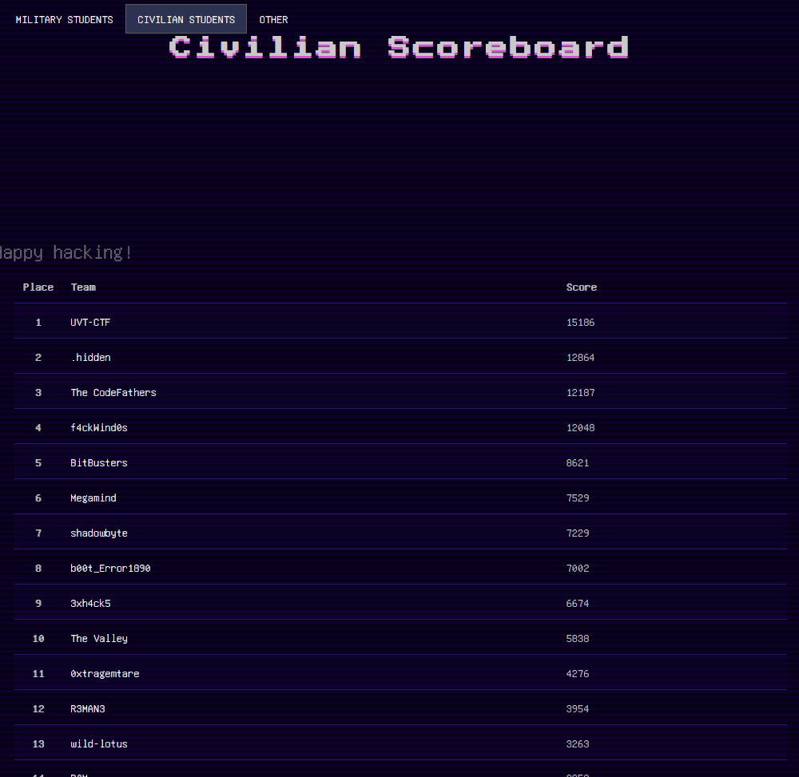
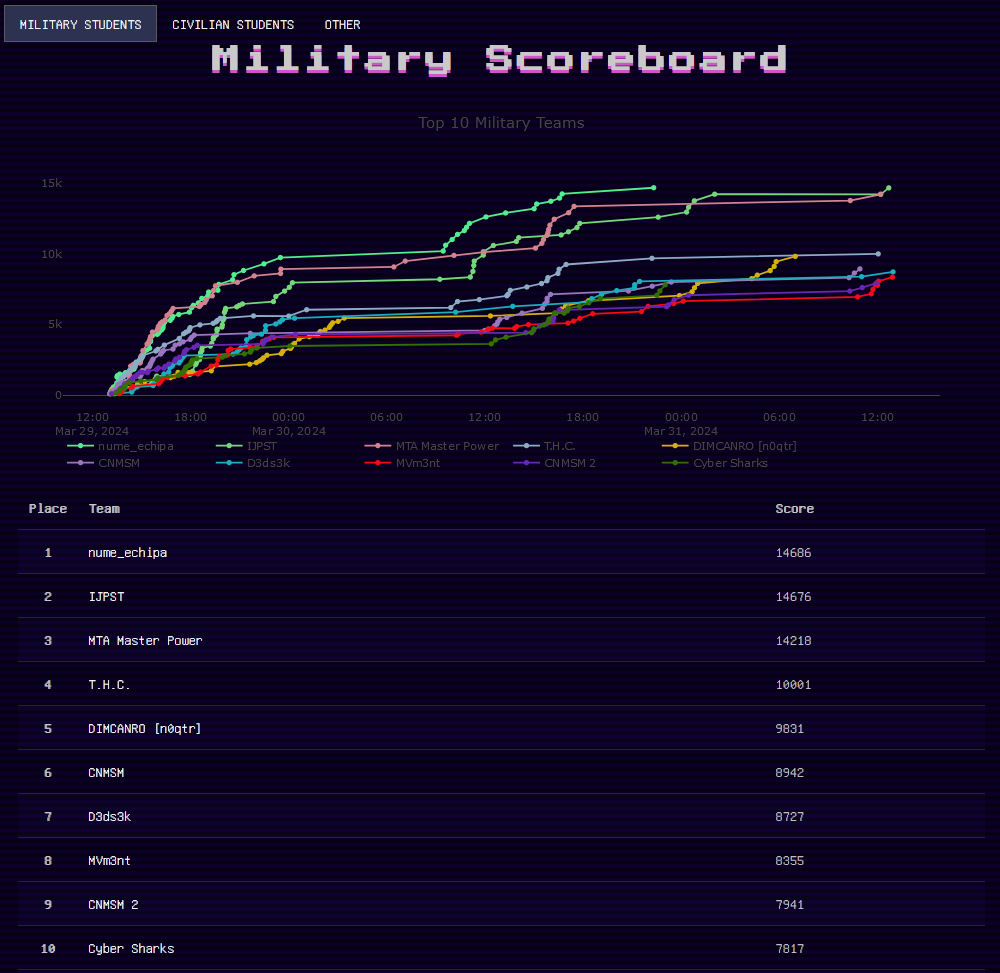

# Challenges by categories

<a href="https://ctf.chronossec.site/challenges"><b>CSCTF 2024 - challenges</b></a>

 
 

<table border="0">
  <tr>
    <td></td>
    <td></td>
  </tr>
</table>

 
 

| Category | Name | Points | Solves | Difficulty |
|---|---|---|---|---|
| Crypto | <a href="./Crypto/3.146416102">3.146416102</a> | 426 | 9 | hard |
| Crypto | <a href="./Crypto/Authentication">Authentication</a> | 100 | 51 | easy |
| Crypto | <a href="./Crypto/Double Trouble">Double Trouble</a> | 155 | 33 | medium |
| Crypto | <a href="./Crypto/Hashes">Hashes</a> | 193 | 28 | easy |
| Crypto | <a href="./Crypto/Signed Flask">Signed Flask</a> | 323 | 17 | medium |
| Crypto | <a href="./Crypto/Weak Password 1">Weak Password 1</a> | 105 | 47 | easy |
| Crypto | <a href="./Crypto/Weak Password 2">Weak Password 2</a> | 149 | 34 | easy |
| Forensics | <a href="./Forensics/APT Hunting">APT Hunting</a> | 438 | 8 | easy |
| Forensics | <a href="./Forensics/Magical Bytes 1">Magical Bytes 1</a> | 149 | 34 | easy |
| Forensics | <a href="./Forensics/Magical Bytes 2">Magical Bytes 2</a> | 468 | 5 | easy |
| Forensics | <a href="./Forensics/Nothing Here">Nothing Here</a> | 458 | 6 | hard |
| Forensics | <a href="./Forensics/VirusTotal.exe">VirusTotal.exe</a> | 104 | 48 | easy |
| Linux | <a href="./Linux/Calculator">Calculator</a> | 337 | 16 | medium |
| Linux | <a href="./Linux/Custom Request 1">Custom Request 1</a> | 297 | 19 | easy |
| Linux | <a href="./Linux/Custom Request 2">Custom Request 2</a> | 337 | 16 | easy |
| Linux | <a href="./Linux/Extraction 1">Extraction 1</a> | 126 | 39 | easy |
| Linux | <a href="./Linux/Extraction 2">Extraction 2</a> | 107 | 46 | easy |
| Linux | <a href="./Linux/John">John</a> | 184 | 29 | easy |
| Linux | <a href="./Linux/Lite">Lite</a> | 111 | 44 | easy |
| Linux | <a href="./Linux/My secure password">My secure password</a> | 283 | 20 | medium |
| Misc | <a href="./Misc/Customer support">Customer support</a> | 100 | 59 | easy |
| Misc | <a href="./Misc/Decoding">Decoding</a> | 107 | 46 | easy |
| Misc | <a href="./Misc/Index">Index</a> | 104 | 48 | easy |
| Misc | <a href="./Misc/Onions">Onions</a> | 364 | 14 | medium |
| Misc | <a href="./Misc/Participate">Participate</a> | 323 | 17 | easy |
| Misc | <a href="./Misc/Prank">Prank</a> | 100 | 53 | easy |
| Misc | <a href="./Misc/Rules">Rules</a> | 100 | 60 | easy |
| Misc | <a href="./Misc/Shopping list">Shopping list</a> | 468 | 5 | hard |
| Misc | <a href="./Misc/Simple quiz">Simple quiz</a> | 100 | 53 | easy |
| Misc | <a href="./Misc/Uncommon">Uncommon</a> | 458 | 6 | medium |
| OSINT | <a href="./OSINT/Breached">Breached</a> | 138 | 36 | easy |
| OSINT | <a href="./OSINT/ChronosPK 1">ChronosPK 1</a> | 138 | 36 | easy |
| OSINT | <a href="./OSINT/ChronosPK 2">ChronosPK 2</a> | 169 | 31 | medium |
| OSINT | <a href="./OSINT/Cyber Golan">Cyber Golan</a> | 169 | 31 | hard |
| OSINT | <a href="./OSINT/Spy Operation">Spy Operation</a> | 500 | 1 | medium |
| OSINT | <a href="./OSINT/WHOis #1">WHOis #1</a> | 102 | 49 | easy |
| OSINT | <a href="./OSINT/WHOis #2">WHOis #2</a> | 101 | 50 | easy |
| OSINT | <a href="./OSINT/WHOis #3">WHOis #3</a> | 310 | 18 | medium |
| Programming | <a href="./Programming/Geography Master">Geography Master</a> | 271 | 21 | medium |
| Programming | <a href="./Programming/Lost flag">Lost flag</a> | 310 | 18 | medium |
| Programming | <a href="./Programming/Math Master">Math Master</a> | 297 | 19 | medium |
| Programming | <a href="./Programming/Multiply 1">Multiply 1</a> | 193 | 28 | easy |
| Programming | <a href="./Programming/Multiply 2">Multiply 2</a> | 223 | 25 | medium |
| Programming | <a href="./Programming/Pwntools">Pwntools</a> | 234 | 24 | medium |
| Pwn | <a href="./Pwn/Dynamic loader">Dynamic loader</a> | 500 | 0 | medium |
| Pwn | <a href="./Pwn/Moooooore">Moooooore</a> | 126 | 39 | easy |
| Pwn | <a href="./Pwn/Trace my libraries">Trace my libraries</a> | 297 | 19 | easy |
| Rev | <a href="./Rev/Elite 1">Elite 1</a> | 169 | 31 | medium |
| Rev | <a href="./Rev/Elite 2">Elite 2</a> | 203 | 27 | hard |
| Rev | <a href="./Rev/Source">Source</a> | 126 | 39 | easy |
| Stegano | <a href="./Stegano/Call me">Call me</a> | 246 | 23 | medium |
| Stegano | <a href="./Stegano/Frequencies">Frequencies</a> | 138 | 36 | easy |
| Stegano | <a href="./Stegano/Hiding in PDF">Hiding in PDF</a> | 415 | 10 | medium |
| Stegano | <a href="./Stegano/More pixels">More pixels</a> | 271 | 21 | easy |
| Stegano | <a href="./Stegano/Neighbor">Neighbor</a> | 448 | 7 | medium |
| Web | <a href="./Web/Basics 1">Basics 1</a> | 100 | 59 | easy |
| Web | <a href="./Web/Basics 2">Basics 2</a> | 122 | 40 | easy |
| Web | <a href="./Web/Basics 3">Basics 3</a> | 138 | 36 | easy |
| Web | <a href="./Web/Basics 4">Basics 4</a> | 155 | 33 | easy |
| Web | <a href="./Web/Cerealized">Cerealized</a> | 364 | 14 | medium |
| Web | <a href="./Web/Options">Options</a> | 377 | 13 | easy |
| Web | <a href="./Web/PHP is simple">PHP is simple</a> | 415 | 10 | medium |
| Web | <a href="./Web/Proxy man">Proxy man</a> | 113 | 43 | easy |
| Web | <a href="./Web/Simple upload">Simple upload</a> | 403 | 11 | medium |
| Windows | <a href="./Windows/DB">DB</a> | 105 | 47 | easy |
| Windows | <a href="./Windows/Together">Together</a> | 126 | 39 | easy |
| Windows | <a href="./Windows/Wi-Fi">Wi-Fi</a> | 100 | 51 | easy |

 
 
