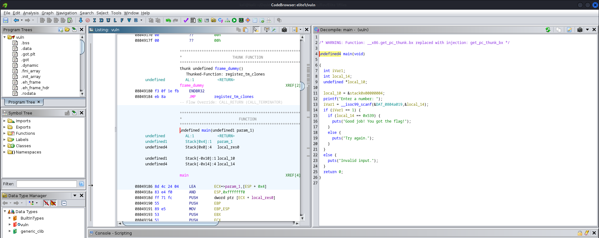

# Elite 1
Author: [Marin Radu](https://github.com/ChronosPK)

<br>

## Description
```
Reveal the correct input by reverse-engineering a compiled binary.
```

<br>

## Requirements
- Decompiled source code analysis
- Reverse engineering tools (such as Ghidra, Radare2, Cutter, GDB)

<br>

## Solve
The challenge binary prompts for an input and compares it to an internally stored hexadecimal value. 
By decompiling the binary, you observe the comparison against `0x539`. 
This hexadecimal number needs to be converted to a decimal format to match the program's expectation for the input, 
which is taken as a decimal number by the `%d` format specifier in the `scanf` function.



The hexadecimal number `0x539` is equivalent to the decimal number `1337`. 
When the correct decimal value is entered, the binary validates the input against the hard-coded hexadecimal value 
and confirms the success of the operation.

In a reverse engineering tool like Ghidra, the comparison operation would look like this in pseudo-C:

```c
if (user_input == 0x539) {
    // success block
}
```

You must convert `0x539` to its decimal equivalent and provide that as input when running the binary.

<br>

> Flag: `CSCTF{1337}`
