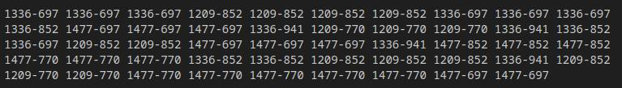

Use [this tool](https://www.dcode.fr/multitap-abc-cipher) to encode the flag using `Multi-Tap Encoder`

Flag: `CSCTF{I_tapped_your_phone}`
Result: `222 7777 222 8 333 0 444 0 8 2 7 7 33 3 0 999 666 88 777 0 7 44 666 66 33`

<br>

Then, use [dual-tone multi-frequency](https://www.dcode.fr/dtmf-code) for another encoding.

Input: `222 7777 222 8 333 0 444 0 8 2 7 7 33 3 0 999 666 88 777 0 7 44 666 66 33`
Output: 
```
1336-697 1336-697 1336-697 1209-852 1209-852 1209-852 1209-852 1336-697 1336-697 1336-697 
1336-852 1477-697 1477-697 1477-697 1336-941 1209-770 1209-770 1209-770 1336-941 1336-852 
1336-697 1209-852 1209-852 1477-697 1477-697 1477-697 1336-941 1477-852 1477-852 1477-852 
1477-770 1477-770 1477-770 1336-852 1336-852 1209-852 1209-852 1209-852 1336-941 1209-852 
1209-770 1209-770 1477-770 1477-770 1477-770 1477-770 1477-770 1477-697 1477-697
```

<br>

Take a nice screenshot and use it in the challenge. 

