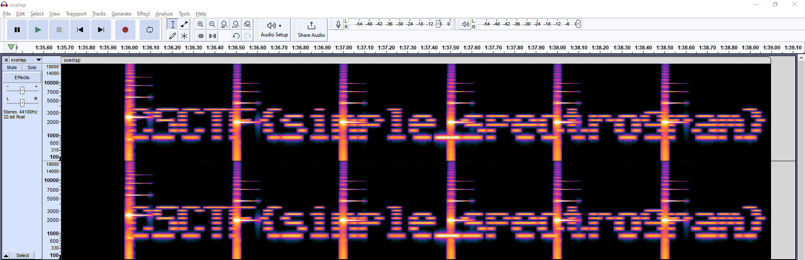

# Frequencies
Author: [Marin Radu](https://github.com/ChronosPK)

<br>

## Description
```
View the audio signal's spectrogram.
```

<br>

## Requirements
- Spectrogram analysis

<br>

## Solve
Open the audio application (`audacity` in my case) and view the spectrogram. <br>
The flag is hidden at the end of the overlapped signals.

</img>

<br>

> Flag: `CSCTF{simple_spectrogram}`