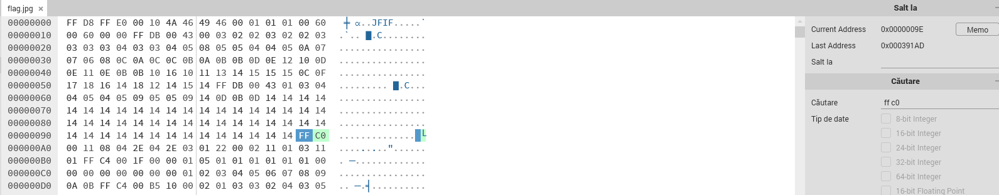

# More pixels
Author: [Marin Radu](https://github.com/ChronosPK)

<br>

### Description
```
Manipulate the height of an image with from the specific bytes
```

<br>

### Requirements
- Image analysis

### Solve
Check [this blog post](https://cyberhacktics.com/hiding-information-by-changing-an-images-height/) that explains how to modify the height (and width) of an JPG image. 

In short, just look for the sequence of hex characters `ff c0`; the next 4 bytes resemble the length, the next 2 are the data precision, then we have 4 bytes for `image height` and 4 more for `image width`.

This image contains the following sequence of bytes: `ff c0`, `00 11`, `08`, `03 2e`, `04 2e`. 

I used [Hexeditor](https://hexed.it/) to 'crop' the image and leave out the flag from the lower part of the image.

- Search for the relevant bytes in hex format
- Modify them to reveal the flag (replace `08 03 2e` with `08 04 2e`)

<br>

<a></a>
<br><br>
<a></a>

<br>

> Flag: `CSCTF{h1dden_pixels_f0r_you}`
