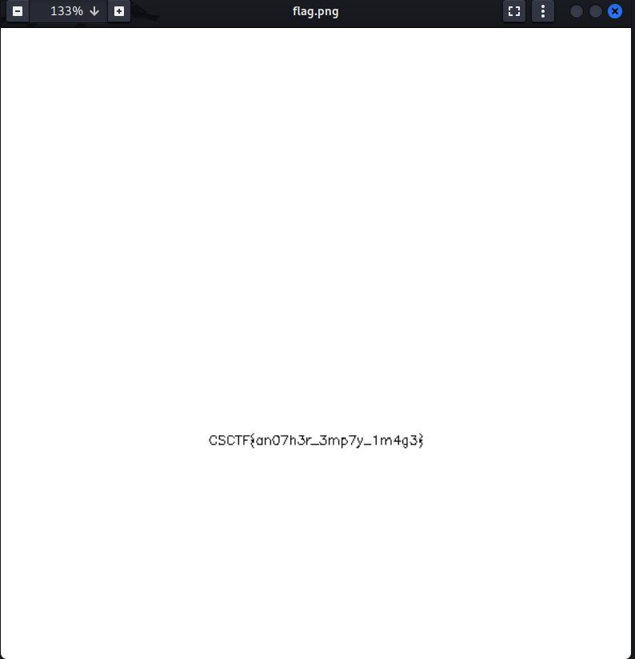

# Neighbor
Author: [Marin Radu](https://github.com/ChronosPK)

<br>

## Description
```
A message is written with pixels with aproximately the same color as the background.
```

<br>

## Requirements
- Analyze the image's pixels

<br>

## Solve
The image contains a message written in a color with values slightly different.

<br>



<br>

[Solution script](./solve.py)

<br>

> Flag: `CSCTF{an07h3r_3mp7y_1m4g3}`
