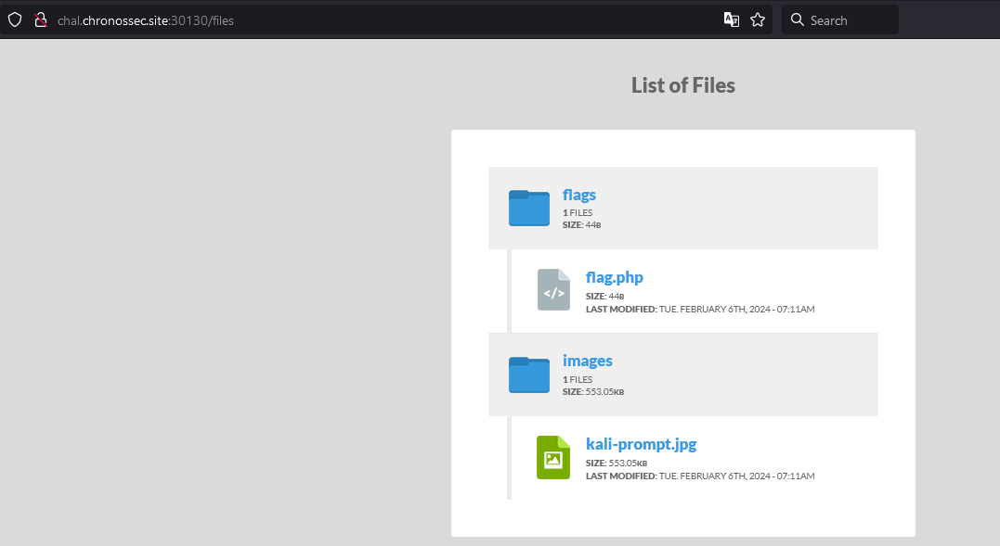

# Basics 3
Author: [Cujbă Mihai](https://www.linkedin.com/in/mihai-cujb%C4%83-109b8a72/)

<br>

## Description
```
Find the flag's location in the source code.
```

<br>

## Requirements
- Source code
- Browsing web pages

<br>

## Solve
In the source code, you can see the location of the image displayed on the screen: `files/images/kali-prompt.jpg`.

What if we check the subdirectories? 
Stepping down 2 directories will reveal a nice **directory listing** in `/files`. 



We can just retrieve the flag from there: `./files/flags/flag.php`

<br>

> Flag: `CSCTF{Listing_ON_Index_OFF}`