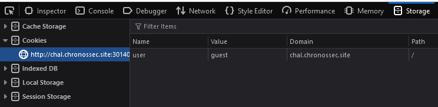
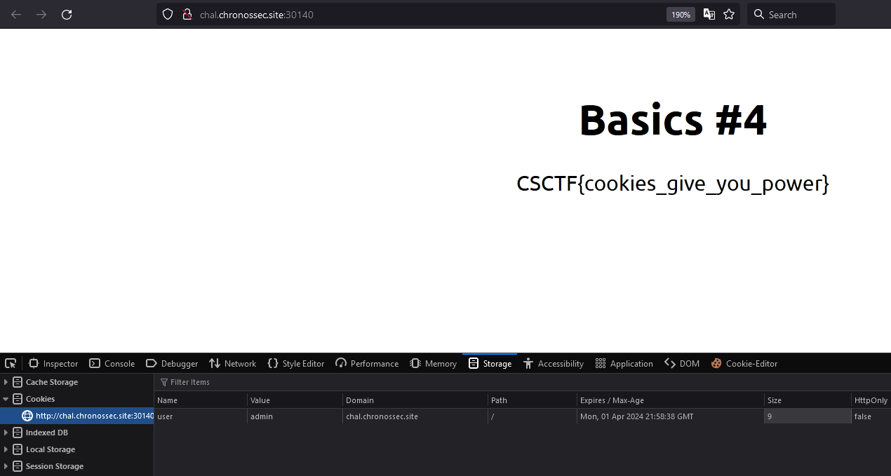

# Basics 4
Author: [Cujbă Mihai](https://www.linkedin.com/in/mihai-cujb%C4%83-109b8a72/)

<br>

## Description
```
Change the cookie's value to become admin
```

<br>

## Requirements
- Cookie authentication

<br>

## Solve
The web application sets the user's state to 'guest' in the cookie.
If we change it to 'admin', we can see the flag (we become admin).

To do this, open `Developer tools` (`CTRL+SHIFT+I`), then select `Storage`.



<br>



<br>

> Flag: `CSCTF{cookies_give_you_power}`