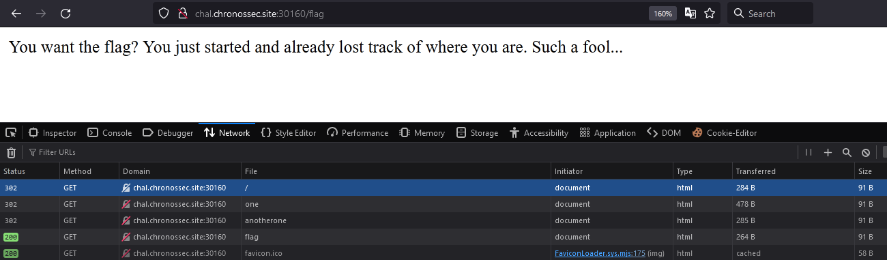

# Options
Author: [Marin Radu](https://github.com/ChronosPK)

<br>

## Description
```
Use different HTTP options
```

<br>

## Requirements
- Understand HTTP options
- Manipulate HTTP requests

<br>

## Solve
If you view the web application in a browser, the redirects will take you to the `/flag` endpoint, 
which is just there to mess with you.

You have to analyze the server's response starting with the root directory:
```bash
URL="http://ctf.chronossec.site:30160"

curl $URL
```



As the challenge's name suggests, you must try different HTTP OPTIONS.

<br>

This is the road to getting the flag:
```bash
URL="http://ctf.chronossec.site:30160"

curl $URL

curl $URL/one

curl $URL/hint

curl $URL/userapp

curl -X POST $URL/userapp

curl -X PUT $URL/.hidden
```

<br>

> Flag: `CSCTF{OPTIONS_Wil1_seT_Y0u_fr33}`