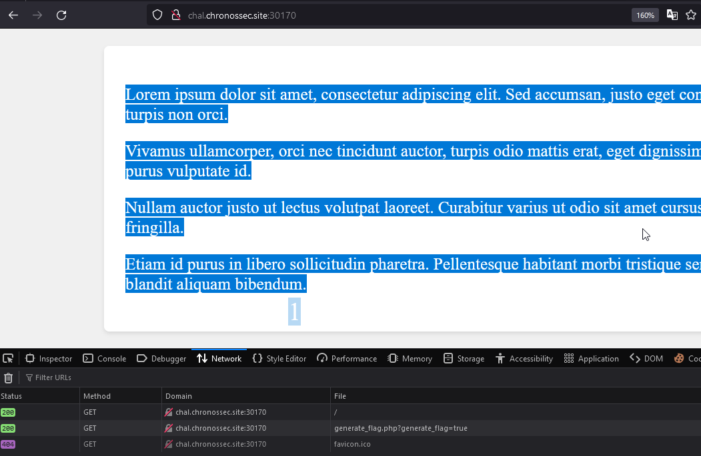
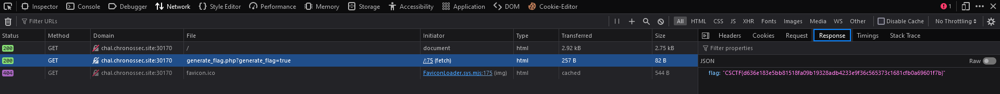

# Proxy man
Author: [Marin Radu](https://github.com/ChronosPK)

<br>

## Description
```
Inspect requests made by the web application
```

<br>

## Requirements
- Understand HTTP requests
- Source code

<br>

## Solve
You need to act as a proxy and inspect the data sent from the index page.

You can either use `BurpSuite` or just `Developer Tools`.



If you use `Developer Tools`, head to the `Network` tab,<br>
select the `generate_flag.php` file, and view the `Response`.

There, you'll see the actual flag that is sent every minute,<br>
changing its contents every 5 minutes.

My script uses the JavaScript `Fetch` API to retrieve the result 
you get when you run the `generate_flag.php` script.<br>
I also created an animation that throws each letter of the flag
in random locations on the screen, one after another.



<br>

> Flag: `CSCTF{hash-that-changes-every-5-minutes}`
