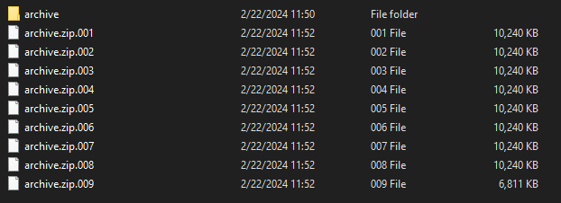

To create this challenge, I used a text file that contains the flag and a few large files.

I needed the large files to be able to split the folder that contains exerything in smaller parts (`.001`, `.002` etc.).

Gather everything in a folder, then use `7-zip` to split the files into parts. This will create a multipart (spanned) archive.

Specify how small a segment must be. I found [this guide](https://support.powerdiary.com/article/550-large-data-zipping-splitting-files-guide) that explains the process. Keep in mind that the smallest part can be 10MB.

Segments after the splitting process:  

The last step is to archive all the parts together. 