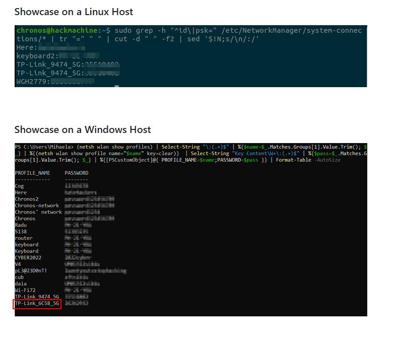

# Wi-Fi
Author: [Marin Radu](https://github.com/ChronosPK)

<br>

## Description
```
Understand how to view WiFi passwords stored on your computer
```

<br>

## Requirements
- Browse a GitHub repository

<br>

## Solve
The GitHub repo is [here](https://github.com/ChronosPK/Local-WiFi-passwords).

The image is at the bottom of the page, as instructed in the challenge's description:



<br>

> Flag: `CSCTF{TP-Link_6C58_5G}`
